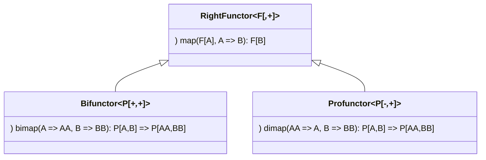
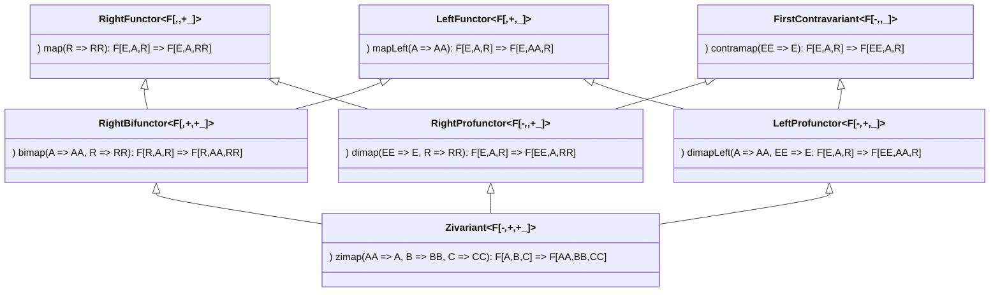
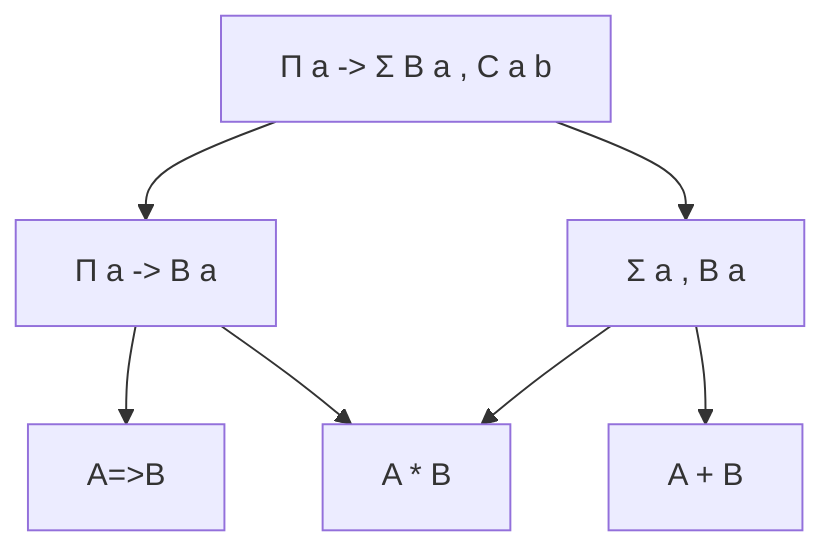
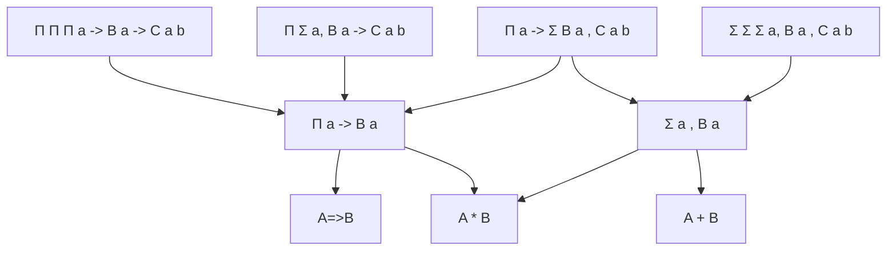

# agda-trio

Encode in Agda some of the previous ideas:
* modular approach to Bifunctor/Profunctor hierarchy ([Haskell](https://github.com/lemastero/trifunctors/blob/master/src/Data/UnifyBifunctorProfunctor.hs), [Scala](https://github.com/lemastero/Triglav/tree/master/src/main/scala/Triglav/face2))

* experiments with:
   * Zifunctor ([Idris](https://github.com/lemastero/Idris-Trifunctors/blob/main/src/Data/Verified/Zifunctor.idr), [Haskell](https://github.com/lemastero/trifunctors/blob/master/src/Data/Zifunctor.hs#L47-L75), [Scala](https://github.com/lemastero/trifunctors/blob/master/src/Data/Zifunctor.hs#L86-L110)),
   * Trifunctor ([Idris](https://github.com/lemastero/Idris-Trifunctors/blob/main/src/Data/Verified/Trifunctor.idr), [Scala](https://github.com/lemastero/Triglav/blob/master/src/main/scala/Triglav/face3/Trifunctor.scala)),
   * Nifunctor ([Idris](https://github.com/lemastero/Idris-Trifunctors/blob/main/src/Data/Verified/Fufunctor.idr), [Haskell](https://github.com/lemastero/trifunctors/blob/master/src/Data/Zifunctor.hs#L86-L110), [Scala](https://github.com/lemastero/Triglav/blob/master/src/main/scala/Triglav/face3/Fnfunctor.scala)) types

* dependent triplets (previously [encoded in Idris](https://github.com/lemastero/Idris-Trifunctors/blob/main/src/Data/Triple.idr))

more precisely

* application to optics (previously [encoded in Scala](https://github.com/lemastero/Triglav/blob/master/src/main/scala/Triglav/optics/TrifunctorOptics.scala#L9-L37))

Similar work:
* Bruno Gavranović [bgavran/DependentOpticsIdris2](https://github.com/bgavran/DependentOpticsIdris2/blob/main/src/DependentOptics.idr)
* Michael Snoyman [snoyberg/trio](https://github.com/snoyberg/trio)
* possibly related: [ajrouvoet/ternary.agda](https://github.com/ajrouvoet/ternary.agda)
